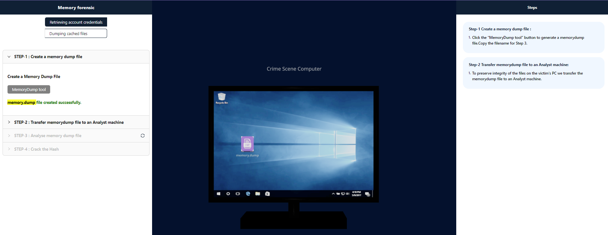
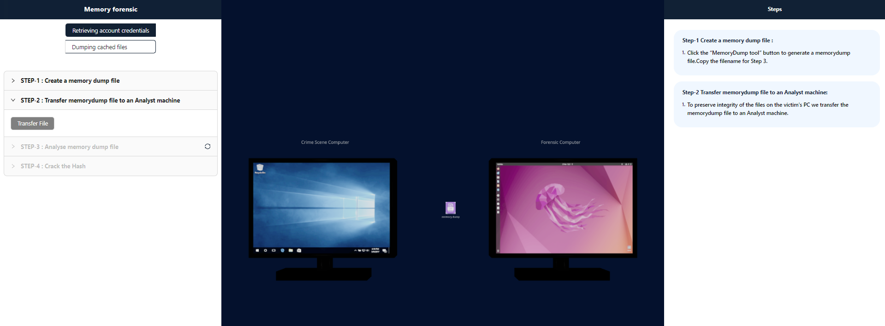
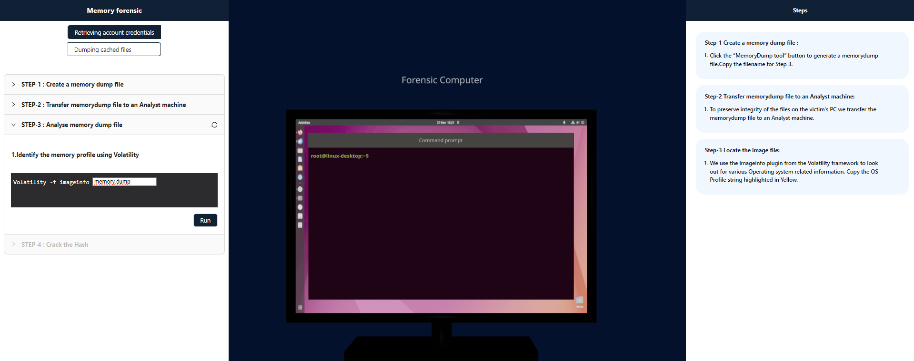
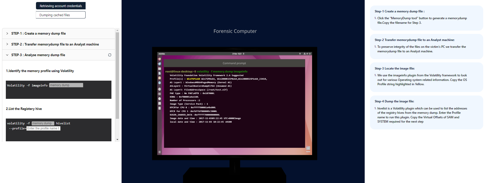
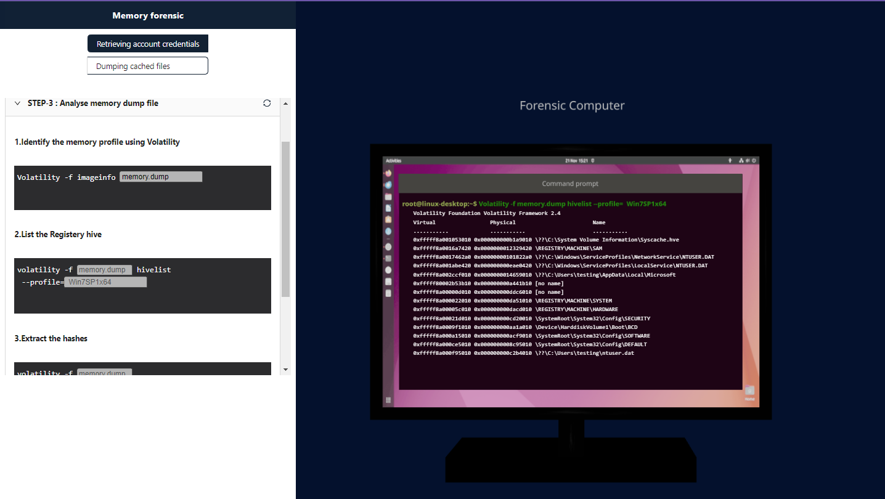
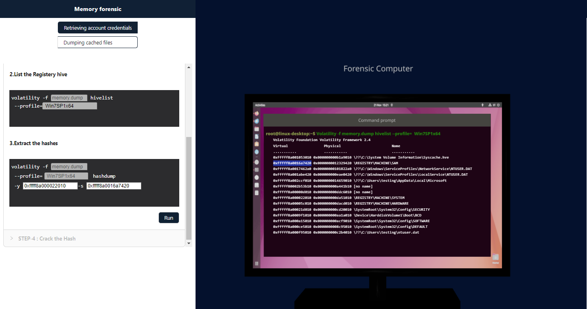
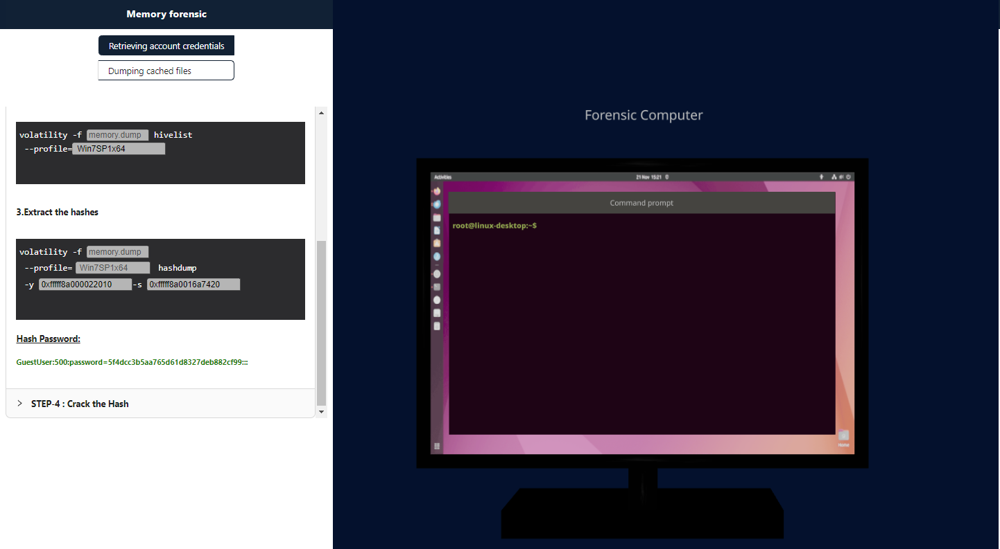
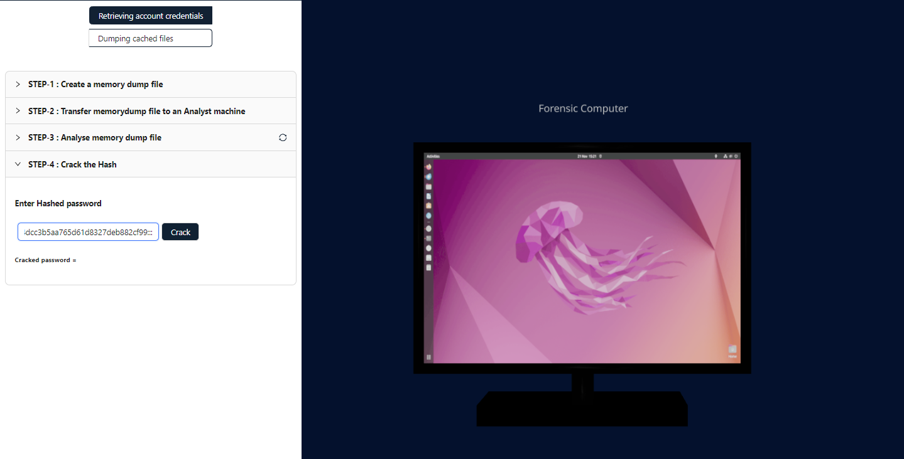
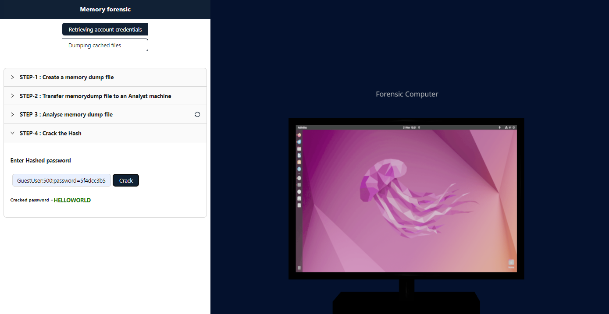

<h3> Procedure</h3>

<b>Step-1 Create a memory dump file :</b>

<li>Click the “MemoryDump tool” button to generate a memorydump file.Copy the filename for Step 3.</li>

<li>Copy the filename  highlighted in yellow color for Step 3.</li>

<b>Step-2 Transfer memorydump file to an Analyst machine:</b>

<li>To preserve integrity of the files on the victim's PC we transfer the memorydump file to an Analyst machine.</li>

<b>Step-3 Locate the image file:</b>

<li>We use the imageinfo plugin from the Volatility framework to look out for various Operating system related information. copy and paste  the filename  highlighted in yellow color from " Step-1:Create a Memory Dump File"</li>

<li>Copy the OS Profile string highlighted in Yellow.</li>

<li>

<b>Step-4 Dump the image file:</b>

<li> Enter the Profile name to run this plugin. Copy the Virtual Offsets of SAM and SYSTEM required for the next step</li>

<b>Step-5 : View the image file:</b>

<li>Paste the SAM and SYSTEM hive offsets in the box.</li>

<li>The SAM and SYSTEM hive offsets are used as input in this step to run hashdump plugin which will print the password hashes. Copy the resulting hashes for the final step.</li>

<b>Paste the hash to crack the password.</b>

<b>Cracked Password</b>

